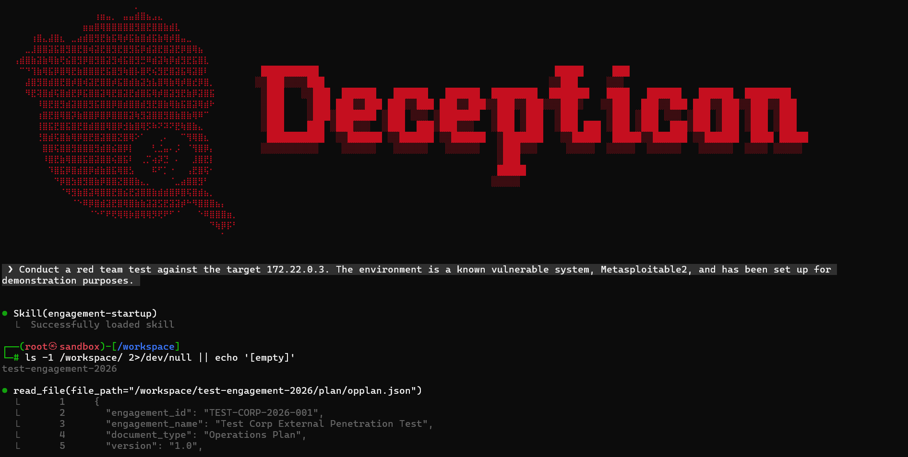

<div align="center">
  
</div>

<h1 align="center">Decepticon</h1>

<p align="center">AI-powered autonomous red team framework.</p>

<div align="center">

<a href="https://github.com/PurpleAILAB/Decepticon/blob/main/LICENSE">
  
</a>
<a href="https://github.com/PurpleAILAB/Decepticon/stargazers">
  
</a>
<a href="https://discord.gg/TZUYsZgrRG">
  
</a>
<a href="https://purpleailab.mintlify.app">
  
</a>

</div>

---

> **Warning**: Do not use this project on any system or network without explicit authorization.

> **Note**: Decepticon 2.0 is currently under active development. For full documentation, architecture details, and philosophy, visit **[purpleailab.mintlify.app](https://purpleailab.mintlify.app)**.

---

## Quick Start

### Prerequisites

- Python 3.13+
- [uv](https://docs.astral.sh/uv/)
- Docker & Docker Compose

### Install

```bash
git clone -b refactor https://github.com/PurpleAILAB/Decepticon.git
cd Decepticon

uv venv && source .venv/bin/activate
uv pip install -e ".[dev]"

cp .env.example .env
# Edit .env — add your API keys
```

### Run

```bash
docker compose up -d --build
decepticon
```

## License

[Apache-2.0](LICENSE)
