# Decepticon 레드팀 인프라 아키텍처

> Decepticon의 레드팀 인프라 구성과 현업 레드팀 인프라와의 매핑을 정의하는 설계 문서.
> 분리형 C2(Command & Control) 모듈 아키텍처를 포함한 전체 공격 인프라 토폴로지를 다룬다.

---

## 1. 현업 레드팀 인프라 개념

### 1.1 Three-Space 모델

현업 레드팀 인프라는 세 개의 논리적 공간으로 분리된다:

| 공간 | 역할 | 구성 요소 |
|------|------|-----------|
| **Red Team Space** | 오퍼레이터 통제 영역 (On-Premise) | 팀 서버(C2), 도구, 설정, 크리덴셜, PCAP/로그 |
| **Gray Space** | 인터넷 노출 중계 영역 (Cloud/VPS) | 리다이렉터, CDN, Domain Fronting 서버 |
| **Victim Space** | 공격 대상 조직 네트워크 | 비콘/에이전트가 실행되는 타겟 시스템 |

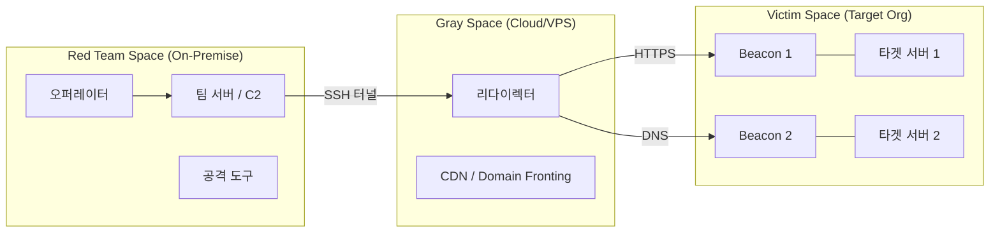

### 1.2 핵심 용어

| 용어 | 설명 |
|------|------|
| **C2 (Command & Control)** | 오퍼레이터가 타겟 내 비콘을 원격 제어하는 중앙 서버 |
| **팀 서버 (Team Server)** | C2 소프트웨어가 실행되는 물리/가상 호스트 |
| **리스너 (Listener)** | 비콘 콜백을 수신하는 핸들러 (프로토콜, 포트, 페이로드 타입 설정) |
| **비콘 (Beacon/Implant)** | 타겟 시스템에서 실행되는 에이전트. C2로 주기적 콜백하며 명령 수신 |
| **리다이렉터 (Redirector)** | C2 트래픽을 중계하여 팀 서버 IP를 은닉하는 프록시 |

---

## 2. Decepticon 인프라 매핑

### 2.1 현업 vs Decepticon 대응 관계

Decepticon은 통제된 Docker 환경에서 운영되므로 OPSEC 기반 인프라 분리(리다이렉터)는 적용하지 않는다. 단, 팀 서버(C2)는 **별도 컨테이너로 분리**하여 모듈 교체가 가능한 구조를 채택한다.

| 현업 구성 요소 | 현업 역할 | Decepticon 대응 | 비고 |
|---|---|---|---|
| **오퍼레이터 (사람)** | 전략 수립, 명령 결정 | **LLM Agent** (Decepticon/Recon/Exploit/PostExploit) | 사람 대신 LLM이 판단 |
| **미션 컨트롤** | 작전 계획, 목표 관리 | **Ralph Loop** (Decepticon Orchestrator) | opplan.json 기반 자동 오케스트레이션 |
| **공격 박스** | 도구 실행 (nmap, sqlmap 등) | **Kali Sandbox** | C2 클라이언트 포함 |
| **팀 서버** | C2 서버 운영 | **C2 컨테이너** (Sliver, Havoc 등) | docker compose profile로 교체 가능 |
| **리다이렉터** | 트래픽 은닉 | **없음** | 통제 환경이므로 불필요 |
| **비콘/Implant** | 타겟 내 원격 에이전트 | **Sliver beacon / Havoc demon** | PostExploit 단계에서 배포 |
| **타겟 네트워크** | 공격 대상 | **Victim 컨테이너** (msf2, DVWA 등) | sandbox-net에서 접근 가능 |

### 2.2 설계 결정: C2 분리 + 리다이렉터 제외

**C2를 별도 컨테이너로 분리하는 이유:**
- C2 프레임워크를 docker compose profile 스왑으로 교체 가능 (Sliver ↔ Havoc ↔ Mythic)
- Kali sandbox 이미지 리빌드 없이 C2만 교체
- 각 C2의 리소스를 독립 관리
- 현업의 팀 서버 분리 구조와 일치

**리다이렉터를 제외하는 이유:**

| 현업에서 리다이렉터가 필요한 이유 | Decepticon에서 불필요한 이유 |
|---|---|
| 블루팀이 비콘 트래픽을 역추적하여 C2 IP 식별 | Docker 네트워크 내 통제 환경, 역추적 위협 없음 |
| 팀 서버 IP가 노출되면 전체 작전 실패 | 단일 sandbox-net 내 통신, 외부 노출 없음 |
| ISP/CDN 레벨에서 C2 트래픽 차단 가능 | 네트워크 필터링 없는 격리 환경 |

---

## 3. 인프라 토폴로지

### 3.1 전체 구성도

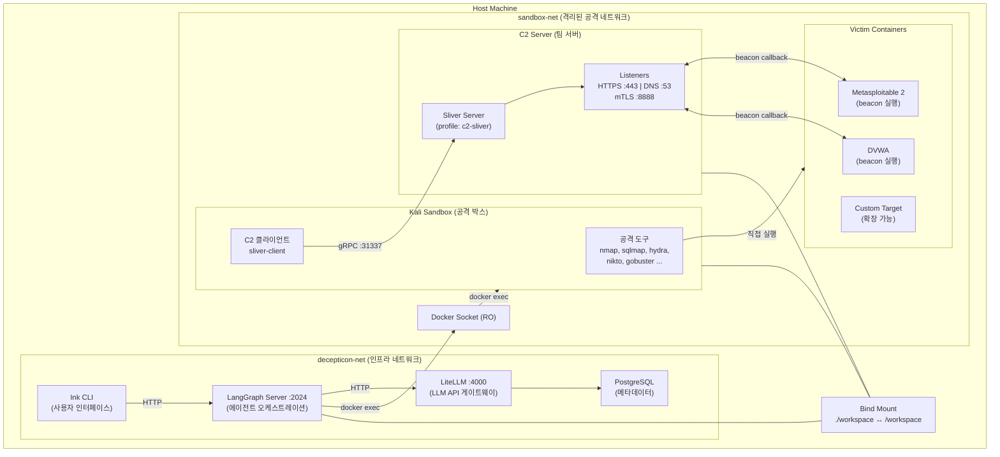

### 3.2 네트워크 격리 구조

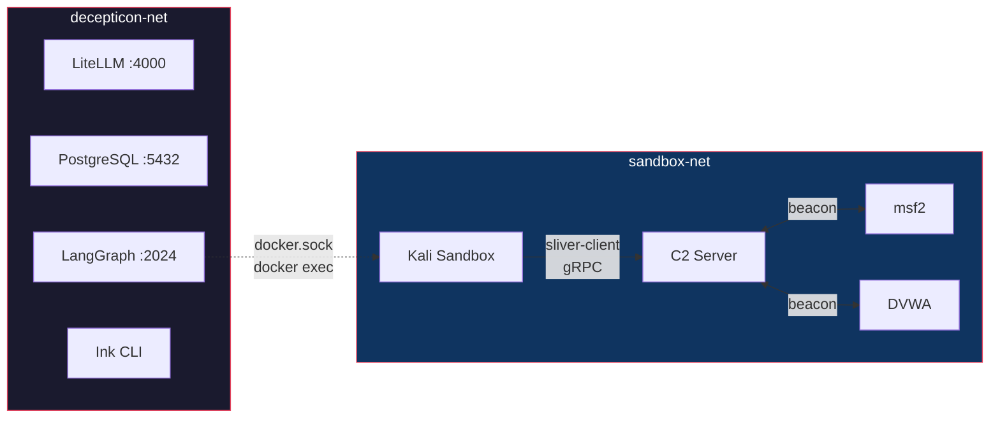

- **decepticon-net**: 인프라 서비스 전용. 외부 포트는 `127.0.0.1`에만 바인딩
- **sandbox-net**: 공격 환경 전용. 인프라 서비스에 대한 네트워크 접근 불가
- **연결 방식**: LangGraph → Docker socket(RO) → `docker exec` → Kali sandbox
- **C2 통신**: Kali의 `sliver-client` → C2 컨테이너 gRPC(:31337) → 비콘 관리

---

## 4. 모듈형 C2 아키텍처

### 4.1 설계 원칙

C2 프레임워크는 **docker compose profile**로 관리되며, profile 스왑으로 교체할 수 있다. LLM 에이전트는 스킬 파일을 통해 각 C2의 CLI를 학습하므로 코드 레벨 추상화 레이어가 불필요하다.

```
C2 교체 = 컨테이너 교체 + 스킬 파일 교체
```

### 4.2 지원 C2 프레임워크

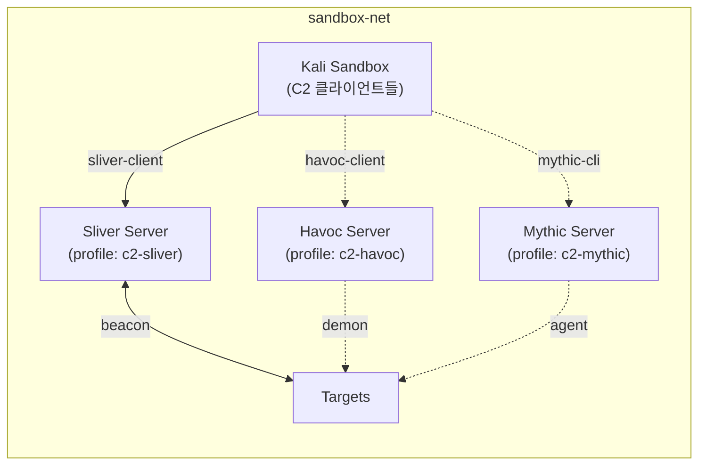

| C2 | Profile | 상태 | 설명 |
|----|---------|------|------|
| **Sliver** | `c2-sliver` | 구현 완료 | BishopFox 오픈소스. mTLS/HTTPS/DNS/WireGuard 리스너 |
| **Havoc** | `c2-havoc` | 향후 | 최신 C2. Demon 페이로드, Sleep obfuscation, Indirect syscalls |
| **Mythic** | `c2-mythic` | 향후 | 모듈형 C2 플랫폼. 다양한 에이전트 프로필 |

### 4.3 C2 사용법

```bash
# Sliver로 engagement 시작
docker compose --profile c2-sliver --profile victims up -d

# C2 교체: Sliver → Havoc
docker compose --profile c2-sliver stop c2-sliver
docker compose --profile c2-havoc up -d c2-havoc

# C2 없이 (Recon/Exploit만)
docker compose up -d
```

### 4.4 컨테이너 구성

**Kali Sandbox (공격 박스)**:
- C2 **클라이언트**만 설치 (`sliver-client`)
- 서버는 실행하지 않음
- 모든 공격 도구 포함 (nmap, sqlmap, hydra, Impacket 등)

**C2 Server (팀 서버)**:
- C2 **서버**만 실행 (`sliver-server daemon`)
- 별도 컨테이너, 별도 이미지
- `sandbox-net`에서 Kali 및 타겟과 통신
- `/workspace` 마운트로 implant 파일 공유
- Named volume으로 C2 데이터(인증서, DB) 영속 보관

---

## 5. 에이전트 파이프라인과 인프라 사용

### 5.1 킬 체인 단계별 실행 모델

Decepticon은 5개 에이전트가 전체 레드팀 킬 체인을 커버한다. 각 단계에서 인프라 사용 방식이 다르다.

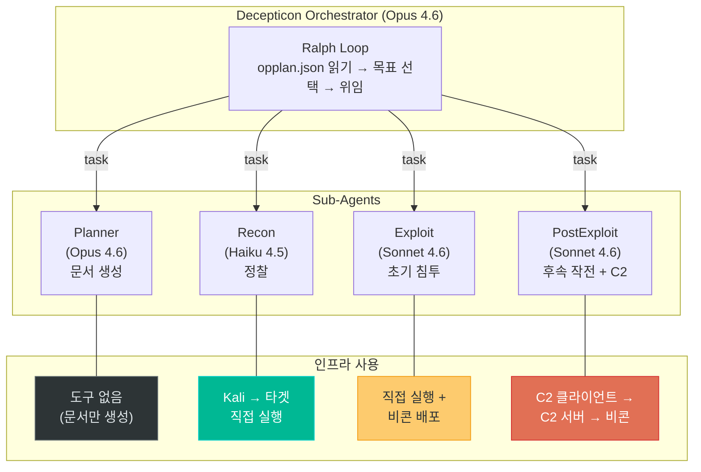

### 5.2 단계별 실행 상세

#### Phase 1: Planning (도구 없음)

Planner 에이전트는 sandbox에 접근하지 않는다. 사용자와 대화하여 engagement 문서를 생성한다.

```
Planner Agent → write_file() → /workspace/plan/roe.json
                                /workspace/plan/conops.json
                                /workspace/plan/opplan.json
```

#### Phase 2: Reconnaissance (직접 실행)

Recon 에이전트는 Kali sandbox에서 타겟을 향해 직접 도구를 실행한다. C2는 사용하지 않는다.

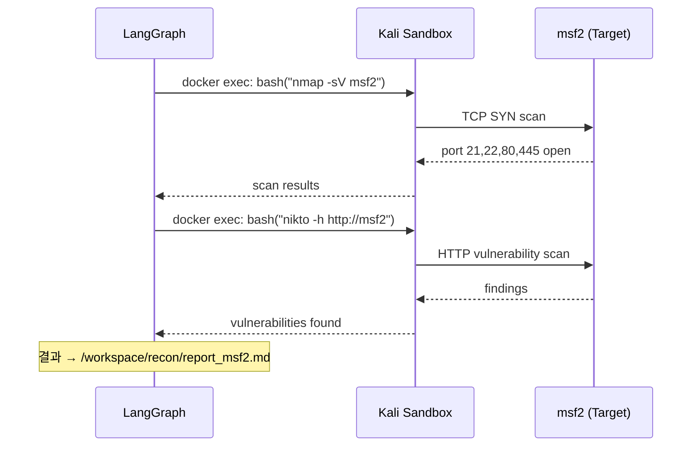

#### Phase 3: Exploitation (직접 실행 + 비콘 배포)

Exploit 에이전트는 취약점을 공격하여 초기 접근 권한을 확보한 후, C2 비콘을 배포한다.

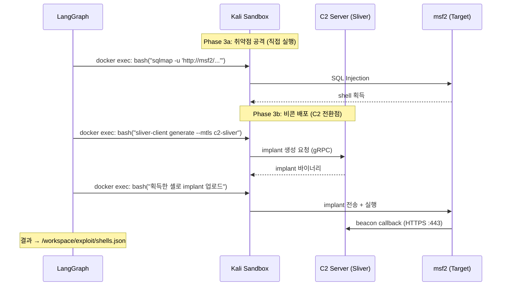

#### Phase 4: Post-Exploitation (C2 클라이언트 → 서버 → 비콘)

PostExploit 에이전트는 Kali의 `sliver-client`를 통해 C2 서버에 연결하고, C2 서버가 비콘에 명령을 전달한다.

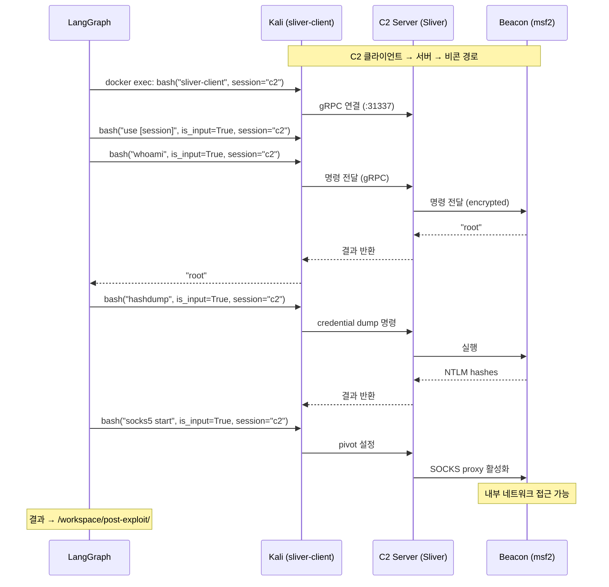

---

## 6. 컨테이너 상세 구성

### 6.1 Kali Sandbox (공격 박스)

| 항목 | 값 |
|------|-----|
| 이미지 | `decepticon-sandbox` (Kali rolling) |
| 메모리 | 4GB |
| CPU | 2코어 |
| PID 제한 | 1024 |
| 네트워크 | `sandbox-net` |
| 사용자 | `operator` (UID 1000, passwordless sudo) |
| 볼륨 | `./workspace:/workspace` |
| 역할 | 공격 도구 실행 + C2 클라이언트 |

**설치된 도구:**

| 카테고리 | 도구 |
|----------|------|
| 정찰 | nmap, dig, whois, subfinder, nikto, gobuster, dirb |
| 공격 | sqlmap, hydra, smbclient, exploitdb |
| C2 클라이언트 | sliver-client |
| 유틸리티 | python3, curl, wget, netcat, tmux |

### 6.2 C2 Server — Sliver (팀 서버)

| 항목 | 값 |
|------|-----|
| 이미지 | `decepticon-c2-sliver` (Kali rolling) |
| Profile | `c2-sliver` |
| 메모리 | 2GB |
| CPU | 1코어 |
| PID 제한 | 512 |
| 네트워크 | `sandbox-net` |
| 사용자 | `sliver` (UID 1000) |
| 볼륨 | `./workspace:/workspace`, `sliver_data:/home/sliver/.sliver` |
| CMD | `sliver-server daemon` |

**노출 포트 (sandbox-net 내부):**

| 포트 | 프로토콜 | 용도 |
|------|----------|------|
| 443 | HTTPS | 비콘 콜백 리스너 |
| 53 | DNS | DNS 터널링 리스너 |
| 8888 | mTLS | 암호화 리스너 |
| 31337 | gRPC | 오퍼레이터 클라이언트 연결 |

### 6.3 C2 데이터 영속성

C2 서버 데이터는 named volume(`sliver_data`)에 저장되어 컨테이너 재생성 시에도 유지된다:

```
sliver_data volume (/home/sliver/.sliver/):
├── certs/           ← TLS 인증서 (첫 실행 시 자동 생성)
├── configs/         ← 오퍼레이터 설정 파일
├── db/              ← SQLite (implant DB, session history)
└── logs/            ← 서버 로그
```

Implant 바이너리는 `/workspace`에 저장하여 Kali sandbox와 공유한다.

---

## 7. 네트워크 통신 흐름

### 7.1 전체 데이터 흐름

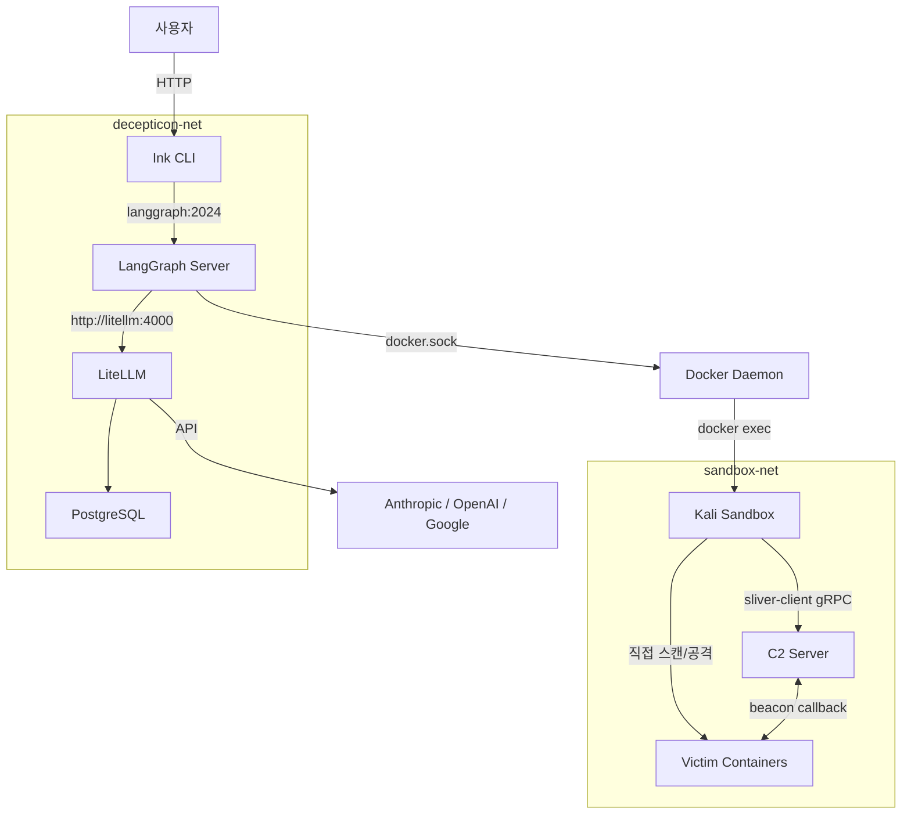

### 7.2 포트 매핑

| 서비스 | 포트 | 바인딩 | 네트워크 |
|--------|------|--------|----------|
| LangGraph API | 2024 | 127.0.0.1 | decepticon-net |
| LiteLLM Proxy | 4000 | 127.0.0.1 | decepticon-net |
| PostgreSQL | 5432 | 127.0.0.1 | decepticon-net |
| Sliver gRPC (operator) | 31337 | sandbox 내부 | sandbox-net |
| Sliver HTTPS Listener | 443 | sandbox 내부 | sandbox-net |
| Sliver DNS Listener | 53 | sandbox 내부 | sandbox-net |
| Sliver mTLS Listener | 8888 | sandbox 내부 | sandbox-net |

---

## 8. Engagement 실행 흐름

### 8.1 전체 워크플로우

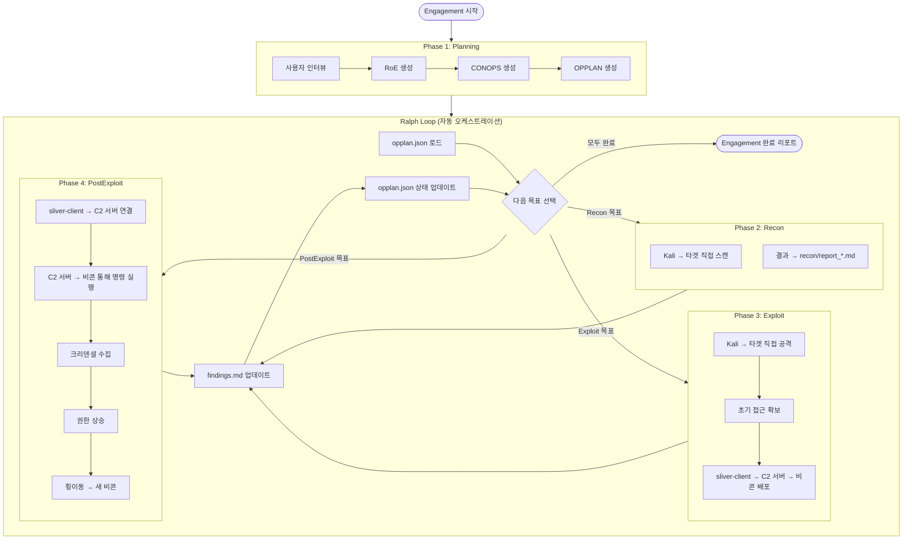

### 8.2 C2 세션 라이프사이클

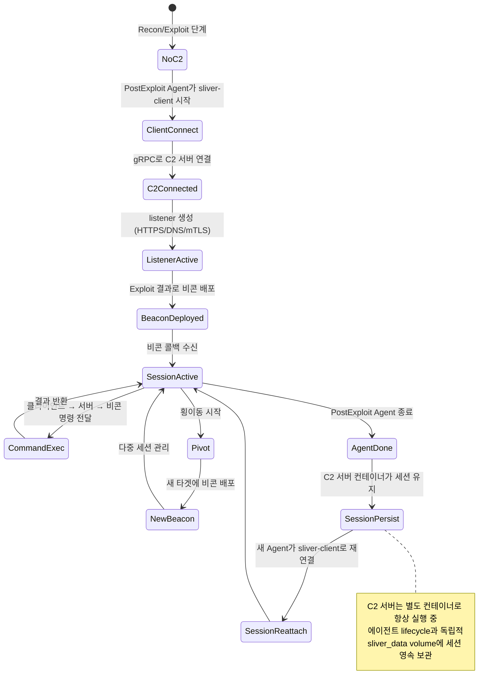

---

## 9. Workspace 디렉토리 구조

```
/workspace/
├── plan/
│   ├── roe.json                  ← 스코프 정의 (매 단계에서 검증)
│   ├── conops.json               ← 위협 모델, 킬 체인
│   ├── opplan.json               ← 목표 목록 (Ralph Loop 드라이버)
│   └── deconfliction.json        ← 충돌 방지 절차
├── recon/
│   ├── report_<target>.md        ← 타겟별 정찰 보고서
│   └── [스캔 결과 파일]
├── exploit/
│   ├── creds_initial.json        ← 초기 크리덴셜
│   ├── shells.json               ← 셸 인벤토리
│   └── [공격 아티팩트]
├── post-exploit/
│   ├── creds/                    ← 수집된 크리덴셜
│   ├── privesc/                  ← 권한 상승 로그
│   ├── lateral/                  ← 횡이동 로그
│   ├── loot/                     ← 목표별 수집 데이터
│   └── network_map.json          ← 내부 네트워크 맵
├── findings.md                   ← Iteration간 누적 발견사항
└── lessons_learned.md            ← 차단된 목표의 교훈
```

---

## 10. 향후 확장 가능성

### 10.1 추가 C2 프레임워크

새 C2를 추가하려면:
1. `containers/c2-<name>.Dockerfile` 작성
2. `docker-compose.yml`에 profile `c2-<name>` 서비스 추가
3. `skills/post-exploit/c2/` 하위에 해당 C2 스킬 추가
4. Kali sandbox에 클라이언트 바이너리 추가

### 10.2 리다이렉터 도입

Defense Evasion 훈련이 필요할 경우, 리다이렉터 컨테이너를 추가할 수 있다.

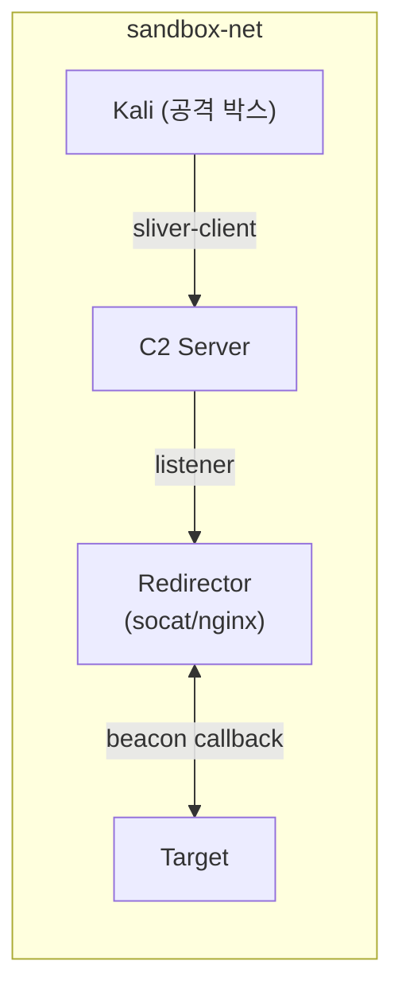

### 10.3 Purple Team 확장

Blue Team 에이전트를 추가하여 Red-Blue 피드백 루프를 구현할 수 있다. 상세는 별도 문서([purple-team-architecture.md](purple-team-architecture.md))에서 다룬다.
